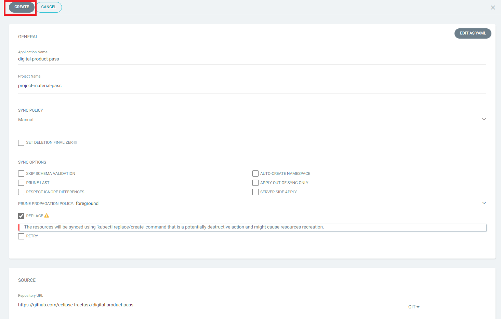
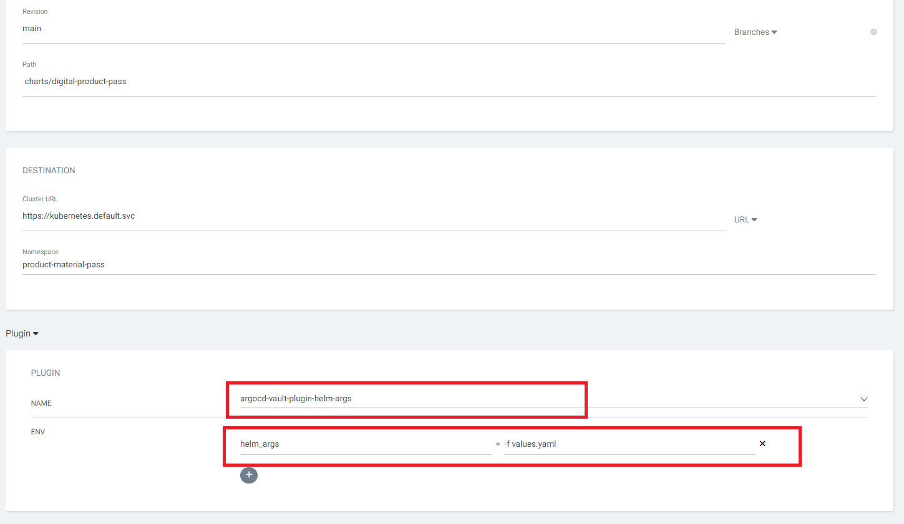
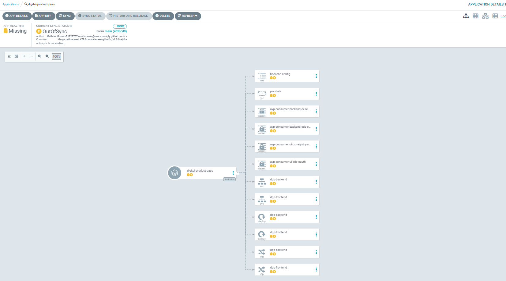
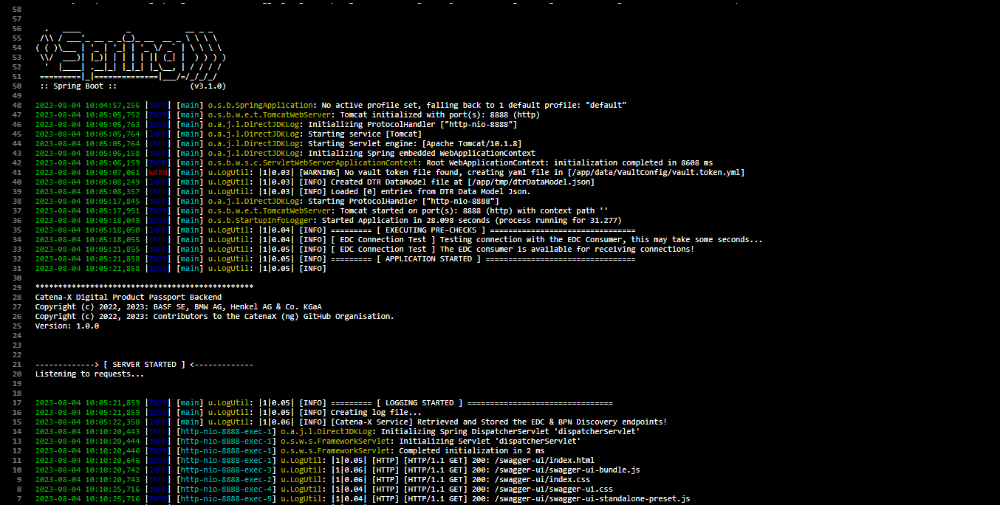
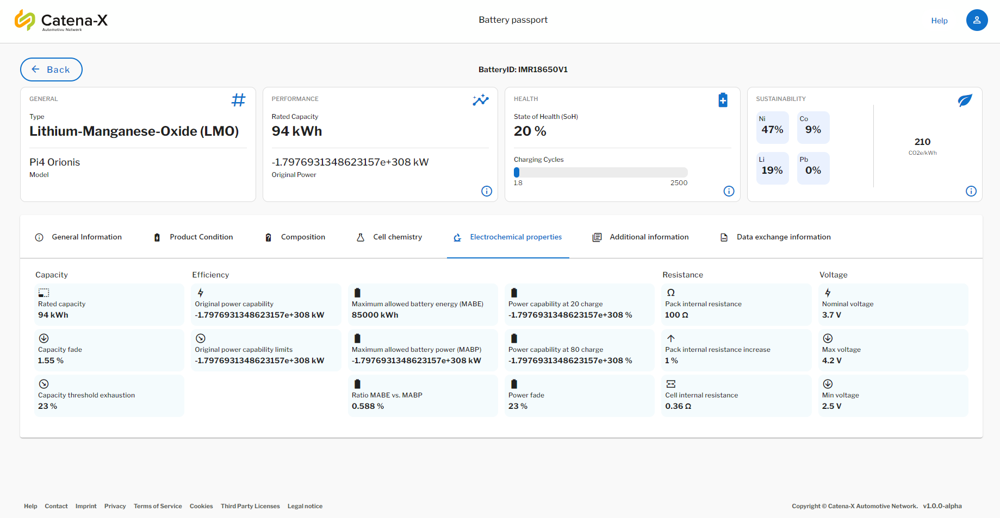
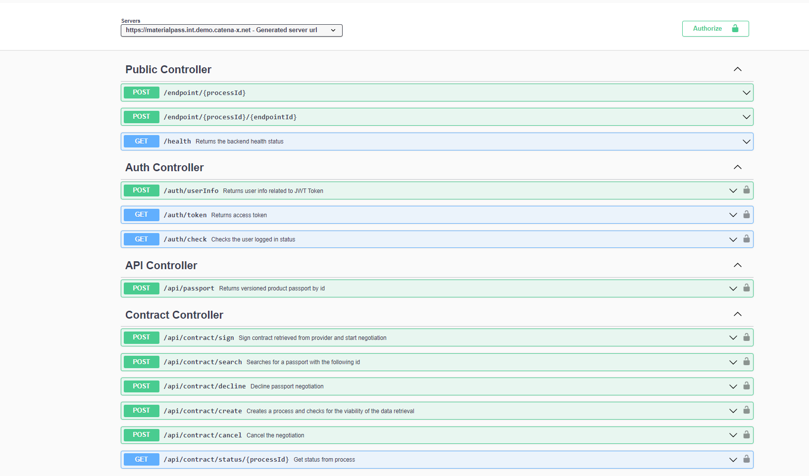

<!--
  Catena-X - Product Passport Consumer Application
 
  Copyright (c) 2022, 2023 BASF SE, BMW AG, Henkel AG & Co. KGaA
 
  See the NOTICE file(s) distributed with this work for additional
  information regarding copyright ownership.
 
  This program and the accompanying materials are made available under the
  terms of the Apache License, Version 2.0 which is available at
  https://www.apache.org/licenses/LICENSE-2.0.
 
  Unless required by applicable law or agreed to in writing, software
  distributed under the License is distributed on an "AS IS" BASIS
  WITHOUT WARRANTIES OR CONDITIONS OF ANY KIND,
  either express or implied. See the
  License for the specific language govern in permissions and limitations
  under the License.
 
  SPDX-License-Identifier: Apache-2.0
-->

## Technical Guide - Deployment in ArgoCD Hotel Budapest


> [Getting Started Documentation](../docs/GETTING-STARTED.md)

This document describes the battery pass application deployment steps in hotel budapest using helm charts. In order to deploy the app components, the following artifacts are required. 

- Link to the Integration environment: [ArgoCD Hotel Budapest INT - Product Material Passport](https://argo.int.demo.catena-x.net)

- [edc-consumer](./helm/edc-consumer)

- [edc-provider](./helm/edc-provider)

- [digital-product-pass](../charts/digital-product-pass)
    - dpp-frontend
    - dpp-backend

#### Sign in via the GitHub account

After signing in into the account, you can see the allocated space inside the namespace 'product-material-pass' and project 'project-material-pass' for the digital product pass team. The new app should be created inside this space.

#### Creating New Application

Create new app from the top-left corner button.
Fill out the following required fields.
- **Application Name:** <APP_NAME> (e.g., edc-consumer, digital-product-pass)
- **Project:** project-material-pass
- **Source:** Git repository where the application artifacts are stored (https://github.com/eclipse-tractusx/digital-product-pass)
- **Revision:** select branch or a tag
- **Path:** The path to the deployment (possible values: deployment/helm/edc-consumer, deployment/helm/edc-provider, charts/digital-product-pass)
- **Cluster URL:** https://kubernetes.default.svc
- **Namespace:** product-material-pass
- **Plugin:** argocd-vault-plugin-helm-args
    - Set following helm args with the corresponding application:
        - digital-product-pass: set ENV as ***helm_args = -f values.yaml'***
        - edc-consumer: set ENV as ***helm_args = -f values.yaml'***
        - edc-provider: set ENV as ***helm_args = -f values.yaml'***

Click on 'Create' button




- Go inside the application and sync it. It would take some time to get synced.




- Go to the individual logs tab

Frontend logs:


Backend logs:


If everything works fine then the application is deployed...

#### Digital-Product-Pass:

##### Consumer-Frontend:

The dpp frontend is a consumer user interface application for the digital product passports that interacts with the end-user and displays passports. The steps above will be followed to deploy the consumer frontend component.

In the end, the frontend should be accessible at https://materialpass.int.demo.catena-x.net. You would be redirected to the CatenaX central IDP and can see the login page after company selection.

##### Login credentails:
- **Company Selection:** CX-Test-Access
- **User 1:** Role: Dismantler, user: company 1 user, Password: changeme
- **User 2:** Role: Recycler, user: company 2 user, Password: changeme

#### Example Screenshots:




##### Consumer-Backend:

The consumer backend is a Java based spring boot application which implements the service modules and business layer to manage the passports in frontend component.

[Open API documentation in Swagger](https://materialpass.int.demo.catena-x.net/swagger-ui/index.html)



<br />

## Helm to manage Kubernetes

### Basic Helm tricks

<details><summary>show</summary>
<p>

```bash
# Creating basic helm chart
helm create <CHART_NAME>

# Building chart dependencies
 helm dependency build <SOURCE>

# Updating chart dependencies
 helm dependency update <SOURCE>

# Installing helm release
helm install <CHART_NAME> -f myvalues.yaml ./SOURCE

# Uninstalling helm release
helm uninstall <CHART_NAME>

# Listing helm releases
helm list
```
<p>
</details>

### Using Helm Repository
<details><summary>show</summary>
<p>

```bash
helm repo add [NAME] [URL]  [flags]

helm repo list / helm repo ls

helm repo remove [REPO1] [flags]

helm repo update / helm repo up

helm repo update [REPO1] [flags]

helm repo index [DIR] [flags]
```
<p>
</details>

### Download a Helm chart from a repository 

<details><summary>show</summary>
<p>

```bash
helm pull [chart URL | repo/chartname] [...] [flags] ## this would download a helm, not install 
helm pull --untar [rep/chartname] # untar the chart after downloading it 
```

</p>
</details>
